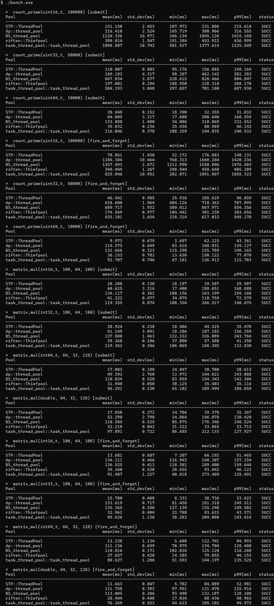

# STP: A Lightweight C++23 Thread Pool

STP (Simple ThreadPool) is a highly optimized, header-only C++ thread pool designed for ultra-low latency and maximum CPU utilization.

Primarily developed for educational purposes, STP is robust enough to be deployed in production environments with straightforward requirements. It encapsulates all the fundamental architectural elements required for a high-performance thread pool. The source code features comprehensive comments, with a strong emphasis on explaining the exact reasoning behind every `std::memory_order` selection. As demonstrated in the benchmarks, STP delivers highly competitive performance, frequently outperforming mainstream open-source alternatives.

***Note:** The development of this project was completed with AI assistance.*

## Key Features

* **Zero-Allocation Task Wrapper:** Employs a custom, move-only inline callable wrapper instead of `std::function`. This eliminates dynamic heap allocations and ensures the closure fits exactly within a single cache line, preventing secondary cache misses during task execution.
* **Lock-Free Bounded MPMC Queue:** Uses a sequence-based lock-free ring buffer for task storage. This avoids the severe contention and context-switching overhead associated with traditional mutex-based queues.
* **Work-Stealing Architecture:** Assigns a dedicated queue to each thread while allowing idle threads to steal work from randomized peers. This significantly minimizes thread contention and maintains high CPU saturation under uneven workloads.
* **Futex-Optimized Wakeups:** Implements Dekker's algorithm combined with C++20 atomic wait mechanisms. This prevents the "missed-wakeup" anomalies common in lock-free designs without relying on heavyweight locks.
* **Cache-Line Alignment:** Strategically applies padding and alignment (`alignas(64)`) to all shared atomic variables. This strictly prevents false sharing, ensuring atomic operations across multiple cores do not unnecessarily invalidate each other's L1 caches.
* **Strictly Controlled Memory Ordering:** Replaces conservative sequential consistency with precisely tuned `acquire`/`release` and `relaxed` semantics on atomic operations. This maximizes instruction-level parallelism and prevents unnecessary memory barrier overhead on modern CPUs.

## Quick Start

STP provides two primary interfaces for task submission:

1. `template <typename F, typename... Args> void execute(F&& f, Args&&... args)`
   * **Fire-and-forget execution.** Enqueues a task without returning a future, offering the absolute lowest overhead.
2. `template <typename F, typename... Args> auto push(F&& f, Args&&... args) -> std::future<std::invoke_result_t<F, Args...>>`
   * **Future-based execution.** Enqueues a task and returns a `std::future`. Ideal for retrieving return values or synchronizing task completion.

Since STP is header-only, simply include the headers in your project.

```cpp
#include "stp_thread_pool.h"
#include <iostream>

int main()
{
    // Initialize thread pool with hardware concurrency
    STP::ThreadPool pool(std::thread::hardware_concurrency());

    // 1. Fire-and-forget using execute()
    pool.execute([] {
        std::cout << "Executing detached task.\n";
    });

    // 2. Retrieve a result using push()
    auto future_result = pool.push([](int a, int b) {
        return a + b;
    }, 40, 2);

    // Block and wait for the result
    std::cout << "Result: " << future_result.get() << "\n";

    return 0; // Pool joins all threads gracefully on destruction
}
```

## Benchmark

STP includes a unified benchmarking framework to evaluate its performance against leading open-source thread pool implementations: [dp::thread_pool](https://github.com/ptsouchlos/thread-pool), [BS::thread_pool](https://github.com/bshoshany/thread-pool), [riften::Thiefpool](https://github.com/ConorWilliams/Threadpool), and [task_thread_pool::task_thread_pool](https://github.com/alugowski/task-thread-pool). Results demonstrate that STP consistently ranks first or in performance across almost all tested scenarios.

### Test Environment

* **OS:** Windows 11  23H2
* **CPU:** 12th Gen Intel(R) Core(TM) i7-12700H 2.30 GHz
* **Logical Cores:** 20
* **Compiler Environment:** w64devkit (2.6.0)
* **g++:** 15.2.0
* **cmake:** 4.2.3
* **make:** 4.4.1
* **ninja:** 1.13.2

### Build and Run

To run the benchmark suite locally:

```bash
cd benchmark
cmake -S . -B build
cmake --build build
cd build
./bench.exe
```

### Results

<details>
  <summary>view image</summary>
  
</details>

### License

This project is licensed under the GNU General Public License v3.0 (GPLv3). See the [LICENSE](LICENSE) file for details.
